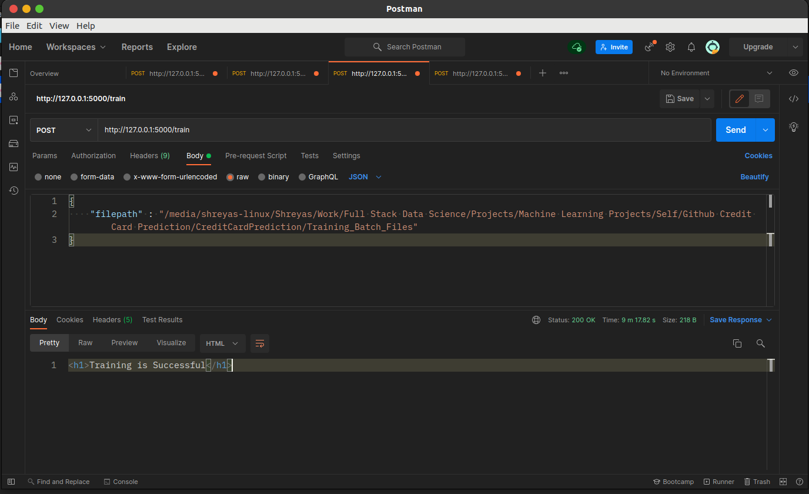
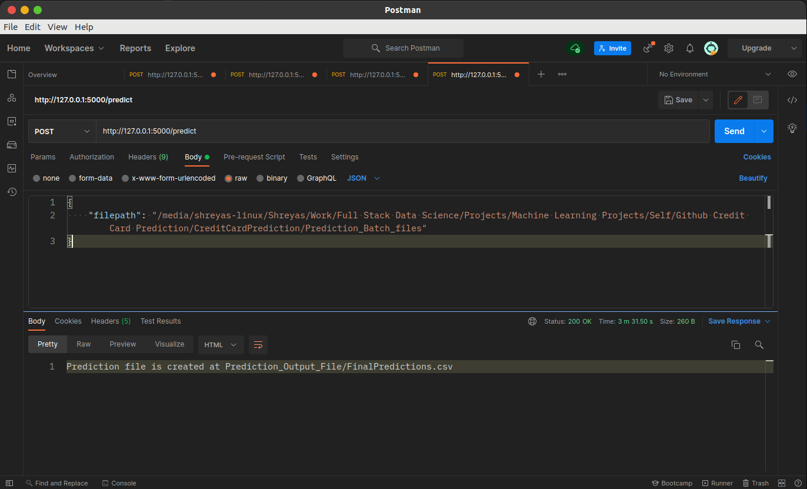

## Credit Card Defaulter

To build a classification methodology to determine whether a person defaults the credit card payment for the next month. 

### Data Description
The client will send data in multiple sets of files in batches at a given location. The data has been extracted from the census bureau. 
The data contains 32561 instances with the following attributes:

#### Features

    1. LIMIT_BAL: continuous.Credit Limit of the person.
    2. SEX: Categorical: 1 = male; 2 = female
    3. EDUCATION: Categorical: 1 = graduate school; 2 = university; 3 = high school; 4 = others
    4. MARRIAGE: 1 = married; 2 = single; 3 = others
    5. AGE-num: continuous. 
    6. PAY_0 to PAY_6: History of past payment. We tracked the past monthly payment records (from April to September, 2005)
    7. BILL_AMT1 to BILL_AMT6: Amount of bill statements.
    8. PAY_AMT1 to PAY_AMT6: Amount of previous payments.
    9. Target Label: Whether a person shall default in the credit card payment or not. default payment next month:  Yes = 1, No = 0.


### Data Validation 

In this step, we perform different sets of validation on the given set of training files.

1. **Name Validation -** We validate the name of the files based on the given name in the schema file. We have created a regex pattern as per the name given in the schema file to use for validation. After validating the pattern in the name, we check for the length of date in the file name as well as the length of time in the file name. If all the values are as per requirement, we move such files to "Good_Data_Folder" else we just delete them.


3. **Number of Columns** - We validate the number of columns present in the files, and if it doesn't match with the value given in the schema file, then the file is removed.


3. **Name of Columns** - The name of the columns is validated and should be the same as given in the schema file. If not, then the file is removed.


5. **The datatype of columns** - The datatype of columns is given in the schema file. It is validated when we insert the files into Database. If the datatype is wrong, then the file is removed the file.

### Data Insertion in Database
 
1) **Database Creation and connection** - Create a database with the given name passed. If the database has already been created, open a connection to the database.


2) **Table creation in the database** - Table with name - "Good_Raw_Data", is created in the database for inserting the files from the "Good_Raw" based on given column names and datatype in the schema file. If the table is already present, then the new table is not created, and new files are inserted in the already present table as we want training to be done on new as well as old training files.     


3) **Insertion of files in the table** - All the files in the "Good_Raw" are inserted in the above-created table. If any file has invalid data type in any of the columns, the file is not loaded in the table.

### Model Training 
1) **Data Export from Db** - The data in a stored database is exported as a CSV file to be used for model training.


2) **Clustering** - KMeans algorithm is used to create clusters in the preprocessed data. The optimum number of clusters is selected by plotting the elbow plot, and for the dynamic selection of the number of clusters, we are using "KneeLocator" function. The idea behind clustering is to implement different algorithms
The Kmeans model is trained over preprocessed data, and the model is saved for further use in prediction.


3) **Model Selection** – After the clusters have been created, we find the best model for each cluster. We are using two algorithms, “Naïve Bayes” and "XGBoost". For each cluster, both the algorithms are passed with the best parameters derived from GridSearch. We calculate the AUC scores for both models and select the model with the best score. Similarly, the model is selected for each cluster. All the models for every cluster are saved for use in prediction.

__Note__: The same steps are followed for the Prediction Data

### Run Locally

1. Initialize the empty git repo. If you don't have the git installed on your machine please download the git using this link.
    <a href="https://git-scm.com/downloads" target="_blank">Download Git</a>


2. Clone the github repo using following command.

```bash
  $ git clone https://github.com/Sparab16/CreditCardPrediction.git
```

3. Change the working directory to the project directory:
```bash
  $ cd CreditCardPrediction
```

4. Create a python/conda virtual env. If you don't know how to create here is the link to follow
	1. Using conda,
		Follow this link: https://uoa-eresearch.github.io/eresearch-cookbook/recipe/2014/11/20/conda/
	2. Using pip,
		Follow this link: https://docs.python.org/3/library/venv.html
   

5. Install all the requirements

```bash
  $ pip install -r requirements.txt
```

6. Run the make_dirs.py file to setup the folder which will require in Prediction and Training purpose

```bash
  $ python make_dirs.py 
```

7. Download the training and prediction batch files from the below links and put it inside the Training_Batch_Files 
and Prediction_Batch_files folder respectively.

    Training_link:-  https://drive.google.com/drive/folders/1mBzDnjjXiceWfcWJAX4EPSP-4MyifubC?usp=sharing
    Prediction_link:-  https://drive.google.com/drive/folders/19z1M5fKm8R8MK2O-bmruqCSMMIu-T_qD?usp=sharing


8. Run the main.py

```bash
  $ python main.py
```


9. Copy the Training_Batch_Files path and hit the /train route to train the model. 
Add the content-type to application/json in the Postman app.

    

10. Copy the Prediction_Batch_files path and hit the /predit route to get the prediction from the model.
Add the content-type to application/json in the Postman app.

    

### Usage

#### Development

Want to contribute? Great!

To fix a bug or enhance an existing module, follow these steps:

<li> Fork the repo
<li> Create a new branch

```bash
 $ git checkout -b new-feature
```
<li> Make the appropriate changes in the file
<li> Commit your changes

```bash
$ git commit -am "New feature added"
```

<li> Push to the branch

```bash
$ git push origin new-feature
```

<li> Create a pull request

### Tech Stack

#### Project is built with:-

- <a href='https://www.python.org/' target="_blank">Python</a>
- <a href='https://flask.palletsprojects.com/en/2.0.x/' target="_blank">Flask</a>
- <a href="https://numpy.org/" target='_blank' > Numpy</a>
- <a href="https://pandas.pydata.org/" target="_blank"> Pandas</a>
- <a href="https://scikit-learn.org/" target="_blank"> Sklearn</a>
- <a href="https://xgboost.readthedocs.io/en/latest/" target="_blank">XGboost </a>
- <a href="https://scikit-learn.org/stable/modules/naive_bayes.html" target="_blank">Naive Bayes</a>

**Database:** 
- <a href='https://www.sqlite.org/index.html' target="_blank">Sqlite3</a>

  
### Authors

- [@Shreyas](https://github.com/Sparab16)


## Hello, I'm Shreyas! 👨🏼‍💻
  
### 🔗 Links
[](https://www.linkedin.com/in/shrey16/)

### License

MIT License

Copyright (c) 2021 Shreyas

Permission is hereby granted, free of charge, to any person obtaining a copy
of this software and associated documentation files (the "Software"), to deal
in the Software without restriction, including without limitation the rights
to use, copy, modify, merge, publish, distribute, sublicense, and/or sell
copies of the Software, and to permit persons to whom the Software is
furnished to do so, subject to the following conditions:

The above copyright notice and this permission notice shall be included in all
copies or substantial portions of the Software.

THE SOFTWARE IS PROVIDED "AS IS", WITHOUT WARRANTY OF ANY KIND, EXPRESS OR
IMPLIED, INCLUDING BUT NOT LIMITED TO THE WARRANTIES OF MERCHANTABILITY,
FITNESS FOR A PARTICULAR PURPOSE AND NONINFRINGEMENT. IN NO EVENT SHALL THE
AUTHORS OR COPYRIGHT HOLDERS BE LIABLE FOR ANY CLAIM, DAMAGES OR OTHER
LIABILITY, WHETHER IN AN ACTION OF CONTRACT, TORT OR OTHERWISE, ARISING FROM,
OUT OF OR IN CONNECTION WITH THE SOFTWARE OR THE USE OR OTHER DEALINGS IN THE
SOFTWARE.